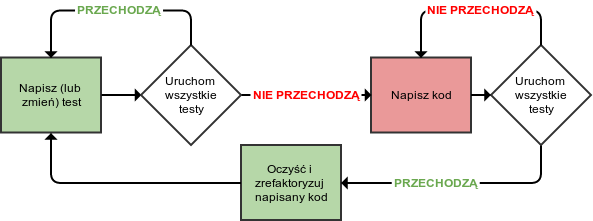

Behavior-driven development
===

Wstęp - o Test-driven development słów kilka
---

Jako, iż BDD oparte jest o TDD, należałoby wprowadzić pewne pojęcia i zarys ideowy przedstawiający o co w tym wszystkim
chodzi.

TDD opiera cały proces tworzenia oprogramowania o jak najkrótszą pętlę zwrotnej informacji na temat działania
tworzonego kodu.
Praca w TDD składa się z wielu iteracji, z których każda obejmuje następujące kroki:

1. Dodaj nowy test.
2. Uruchom wszystkie testy aby sprawdzić czy nowy test przechodzi bezbłędnie.
3. Dodaj kod, który sprawi, że nowy test przejdzie.

    1. Może to być hack lub quick-fix - na tym etapie nie dbamy o utrzymywalność kodu.

4. Uruchom wszystkie testy aby sprawdzić czy nowy test przechodzi bezbłędnie oraz czy nie wprowadzono *regresji*.

    1. Jeżeli wszystko jest OK, przejdź dalej.
    2. W przeciwnym wypadku, wróć do pkt. 3.

5. Oczyść i zrefaktoryzuj kod.

    1. W tym momencie należy uczynić zadość wszelkim grzechom popełnionym w 3.1.

6. Zacznij kolejną iterację.

> Mianem *regresji* określa się zepsucie istniejących wcześniej testów podczas wprowadzania kodu mającego na celu
> spełnienie wymagań testu nowo dodanego.

W bardziej intuicyjnym ujęciu TDD można przedstawić na następującym diagramie:



Główną ideę TDD można sprowadzić do esencjonalnej postaci:

> Dodawaj funkcjonalności i zmieniaj kod jak najmniejszymi krokami.
>
> Na każdą okazję miej zabezpieczenie w postaci testu.
>
> Jeżeli jakikolwiek test przestanie przechodzić - jedyny kod, jaki możesz dodawać, musi mieć na celu zmianę tego stanu.

BDD vs TDD
---

Pracując w TDD, na najbardziej początkowym etapie rozwoju aplikacji czasem nie wiadomo od czego zacząć.
W teorii istnieje jakaś wielka wizja końcowego produktu (albo nawet i nie tyle!), środowiska są przygotowane, ekipa
napojona kawą i nastaje czas by napisać pierwszy prosty test.
Ale czego miałby on dotyczyć?

Znajdujemy się w sytuacji, gdzie jest za wcześnie by dysponoweć na tyle granularną wiedzą by móc bez zawahania rozpocząć
implementację od konkretnego komponentu.

Co więcej, w początkowych fazach projektu często, nawet mimo stosowania TDD, można natrafić na sytuacje, w których
okazuje się, że poszliśmy w stronę, która jakimś sposobem okazała się być niezgodna z założeniami strony klienckiej.
Szkoda, że nikt wcześniej nie był łaskaw o tym nas poinformować.

BDD jest szkieletem pozwalającym na scharakteryzowanie działania aplikacji w postaci *zachowań (behaviors)*, które
powinna przejawiać aby móc uznać ją za spełniającą wymagania klienta.

Jeżeli traktować TDD jako pętlę informacji zwrotnej między developerem a jego kodem, tak BDD stanowi analogiczną pętlę
informacji zwrotnej pomiędzy zespołem dostarczającym oprogramowanie, a interesariuszami definiującymi wymagania.

W BDD, każde zachowanie definiowane jest w języku zbliżonym do naturalnego. Każdy przypadek testowy definiowany jest
jako opowieść (celowe nawiązanie do user story), definiująca co system robić powinien. Jest to bardzo ważna zmiana w
stosunku do innych podejść z kilku względów.

Po pierwsze, istnieje możliwość specyfikacji zachowań w ramach rozmowy z klientem lub inną osobą pełniącą rolę
właściciela produktu.
Osoba nie musi być "techniczna", ze względu na duże zmniejszenie bariery językowej.

Po drugie, duże korzyści płyną również dla pracy z punktu widzenia developera.
Można z pomocą BDD zadawać sobie pytanie: _"Co jest najważniejszą z kolei rzeczą, której ten system jeszcze nie robi?"_.

Zadawanie sobie tego typu pytań pozwala na odkrycie wartości biznesowej funkcjonalności do zaimplementowania i nadania
im na tej podstawie priorytetu. 
Udzielając odpowiedzi na te pytania tak naprawdę formułuje się przypadki testowe w dialekcie BDD:
_"System powinien robić..."_.

Nietrudno wyobrazić sobie o ile łatwiej zrozumieć czego brakuje w momencie gdy nazwa nieprzechodzącego testu brzmi
`Powinien dodawać nowy artykuł do listy` zamiast `TestDodawania`.


Jak to wygląda w praktyce
---

Gdzie w TDD mielibyśmy do czynienia z:

```ruby
def test_todo_creation
    todo = Todo.new
    assert_equal todo.isDone, false
    todo.setContent("Zrób zakupy")
    assert_equal todo.getContent, "Zrób zakupy"
    todo.toggleDone
    assert_equal todo.isDone, true
end
```

W BDD mamy:

```ruby
# Opis zachowań (niech strona kliencka zdefiniuje czego wymaga od aplikacji)
Właściwość: tworzenie listy zadań
    W celu stworzenia listy zadań
    Jako użytkownik
    Chcę tworzyć nowe zadania

    Szablon scenariusza: Puste zadanie
        Zakładając chęć dodania nowego zadania
        Jeżeli dodam nową zadanie do listy
        Wtedy nowe zadanie nie powinno być oznaczone jako 'zrobione'
        Oraz nowe zadanie nie powinno posiadać treści

    Szablon scenariusza: zadanie z treścią
        Zakładając chęć dodania nowego zadania
        Oraz wpisanie 'Zrób zakupy' jako treści zadania
        Jeżeli dodam nową zadanie do listy
        Wtedy nowe zadanie nie powinno być oznaczone jako 'zrobione'
        Oraz nowe zadanie powinno posiadać treść 'Zrób zakupy'

    Szablon scenariusza: Ukończenie zadania
        Zakładając istniejące zadanie
        Jeżeli oznaczę zadanie jako wykonane
        Wtedy zadanie powinno widnieć jako wykonane
```

Każdy z kroków (`Zakładając`, `Jeżeli`, `Wtedy`, `Oraz` ...) ma swoje odzwierciedlenie w kodzie zarządzającym
aplikacją tak by zrealizowała zachowanie przedstawione w scenariuszu:

```ruby
# Definicja kroków (niech programista określi co aplikacja musi wykonać by zrealizować dane zachowanie)
Zakładając /chęć dodania nowego zadania/ do
    todo = Todo.new
end

Zakładając /wpisanie '(.*)' jako treści zadania/ do |s|
    todo.setContent(s.to_s)
end

Wtedy /nowe zadanie powinno posiadać treść '(.*)'/ do |s|
    s.to_s.should == todo.getContent
end

Jeżeli /oznaczę zadanie jako wykonane/ do
    todo.toggleDone
end

# itd. Definicje kolejnych kroków.
```

Przykładowe wyniki testów uzyskane z pomocą narzędzia [Cucumber](http://cukes.info/):


([Źródło](http://blog.jonasbandi.net/2010/03/classifying-bdd-tools-unit-test-driven.html))

Po obejrzeniu przykładowego raportu w stylu BDD widać potencjał prezentowania wyników testów (w odpowiednio
przystosowanej formie) jako sprawozdania z realizacji projektu, przedstawianego interesariuszom biznesowym np. na koniec
sprintu.

BDD a Agile
---

BDD jest silnie związane ze zwinnymi metodykami tworzenia oprogramowania.
Specyfikacje w Cucumberze i testy definiujące zachowania to nie wszystko.
Wszystkie te środki powinny tak naprawdę stanowić narzędzia wspierające podstawowe wartości metodyk zwinnych.

Jak BDD ma się do manifestu Agile?

> Wytwarzając oprogramowanie i pomagając innym w tym zakresie, odkrywamy lepsze sposoby wykonywania tej pracy.
> W wyniku tych doświadczeń przedkładamy:
>
> * **Ludzi i interakcje** ponad procesy i narzędzia.
> * **Działające oprogramowanie** ponad obszerną dokumentację.
> * **Współpracę z klientem** ponad formalne ustalenia.
> * **Reagowanie na zmiany** ponad podążanie za planem.

**Ludzie i interakcje**

BDD rozszerza wspólną płasczyznę komunikacji między 'biznesem' a zespołem programistów.
Komunikacja stanowi podstawę pętli informacji zwrotnej.
Im wyższa jakość i częstotliwość komunikacji, tym pętla jest ciaśniejsza, co umożliwia barzdiej precyzyjną kontrolę nad
postępem prac i kierunkiem realizacji projektu.
Specyfikacja systemu powinna być tworzona wspólnie, poprzez wspólne rozmowy i inne interakcje wspomagające wymianę
informacji oraz punktów widzenia. Obydwie strony czerpią tym sposobem dodatkowe korzyści płynące z dyskusji -
poszerza się horyzont, zostają zadane nowe pytania, wypływają dodatkowe wyzwania. Dodatkowo, próby krystalizowania
scenariuszy w ramach konwersacji powodują rozszerzanie się kontekstu projektu współdzielonego pomiędzy uczestnikami.

**Działające oprogramowanie**

BDD powinno ułatwiać tworzenie oprogramowania. Należy zachować umiar i rozsądek przy 
doborze narzędzi i platform. Mają stanowić one podporę dla zespołu- a nie potwora spaghetti, którego trzeba wlec za sobą.

**Współpraca z klientem** i **Reagowanie na zmiany**

Scenariusz w BDD stanowi *pomysł*, nie jest *obietnicą* czy *zobowiązaniem*.
(Miejsce na zobowiązania jest gdzie indziej.)
W dowolnej chwili realizacji projektu zestaw scenariuszy testowych powinien odwierciedlać stan systemu, zarówno w
kontekście etapu jego realizacji (strona developerska) jak i wizji (strona biznesowa).